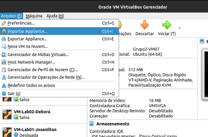

# Projeto do 2º Bimestre
## Introdução

Este repositório contém os passos a serem executados para a criação de Máquinas Virtuais pelo VirtualBox e a interconexão entre 8 máquinas virtuais por cabeamento Ethernet, criando um ambiente de rede virtualizada e permitindo o acesso de cada máquina virtual a partir de um Host

### Tabela de Informações

| Rede       |Máscara         | Gateway      | Broadcast    |
|------------|----------------|--------------|--------------|
|192.168.14.0|255.255.255.240 | 192.168.14.16| 192.168.14.31|

|Grupo 2     | Hostnames                  | FQDN                 | Apelidos    | EndereçosIPs                  |
| -----------| ---------------------------|----------------------|-------------| ------------------------------|
| Iago       |iago1<br> iago2             |grupo2-914.ifalara.net|ig1<br> ig2  |192.168.14.21<br>192.168.14.22 |
| Jhonathan  |jhonathan1<br> jhonathan2   |grupo2-914.ifalara.net|jh1<br> jh2  |192.168.14.19<br> 192.168.14.20|
| Joellen    |joellen1<br> joellen2       |grupo2-914.ifalara.net|joe1<br> joe2|192.168.14.17<br> 192.168.14.18|
| Josenilton |josenilton1<br> josenilton2 |grupo2-914.ifalara.net|jos1<br> jos2|192.168.14.23<br> 192.168.14.24|

| Memória | Processadores | Espaço em disco | Sistema Operacional |
|---------|---------------|-----------------|---------------------|
| 512MB   |      1        |      10GB       | Ubuntu (64-bit)     |

## Tutorial

### Passo 1 - Permissões e Diretórios

Com o Virtual Box instalado (clique [Aqui](https://www.oracle.com/br/virtualization/solutions/try-oracle-vm-virtualbox/?source=:ad:pas:go:dg:a_lad:71700000086180912-58700007355810352-p65903375090:RC_WWMK220429P00062:PORT&SC=:ad:pas:go:dg:a_lad::RC_WWMK220429P00062:PORT:&gclid=Cj0KCQjwrs2XBhDjARIsAHVymmT-qYVIlQKAP6JNYxqoUaCuaH1PaELOxdzk_V2tUpVbWLa8OdAQZsQaAjqgEALw_wcB&gclsrc=aw.ds) para baixar o Virtual Box), criar uma pasta onde será contida a .iso do S.O. Para isso, deve-se entrar no terminal do linux e digitar o comando `su redes` para entrar no Usuário redes, que contém permissões de administrador.
Depois, seguir os comandos: 
```
sudo mkdir /grupo2
cd /grupo2
mkdir images
cd images
mkdir original
```
Para criar a pasta `grupo2` na raiz e as subpastas `images/original` onde ficará a .iso, e 
```
cd /
mkdir grupo2/VM
mkdir grupo2/VM/914
mkdir grupo2/VM/914/<Prof. Alaelson<3 > # substituir <Prof. Alaelson<3 > pelo nome do integrante
```
 
 depois
`
scp aluno@192.168.101.10:~/Public/iso-images/ubuntu-server-mini.ova /labredes/images/original
`
Para baixar o arquivo .ova do computador do Prof. Alaelson :heart:

Modificando as permissões de arquivos e pastas:
```
sudo chown -R nobody:redes /grupo2
sudo chgrp -R redes /grupo2
sudo chmod -R 771 /grupo2 
```

### Passo2 - Rede Ponto a Ponto com Duas Máquinas Virtuais

Instalar a extensão do VirtualBox através dos comandos:
```
su redes
sudo apt install virtualbox-ext-pack
```
No Virtual Box, selecionar a opção Importar Appliance, dentro da opção Arquivo (Figura 1)



e criar uma VM com o .ova (Figura 2)


Depois, instalar o net-tools no terminal de ambas as máquinas:
`
sudo apt install net-tools -y
`
Após isso, devemos editar o arquivo .yaml para configurar as interfaces de rede através do comando:
```
sudo nano /etc/netplan/01-netcfg.yaml
```
Editando o arquivo, deve-se seguir esses comandos:
- colocar o endereço ip junto à mascara do Host
- colocar o endereço ip do gateway
- setar o dhcp para false, assim ele utilizará o endereço ip do campo addresses
```
network:
    ethernets:
        enp0s3:                        
            addresses: [192.168.14.17/28]   
            gateway4: 192.168.14.16         
            dhcp4: false                  
    version: 2
```

Após salvar e sair do arquivo, deve-se rodar o comando `sudo netplan apply` para aplicar as alterações de configurações. 

As VMs consecutivas devem ter seu próprio número no final do endereço ip, é através desse número que os endereços poderão ser diferenciados e acessados. Exemplo:
- Grupo2-VM01 -> 192.168.14.17/28
- Grupo2-VM02 -> 192.168.14.18/28
- Grupo2-VM03 -> 192.168.14.19/28
- Grupo2-VM04 -> 192.168.14.20/28
- Grupo2-VM05 -> 192.168.14.21/28
- Grupo2-VM06 -> 192.168.14.22/28
- Grupo2-VM07 -> 192.168.14.23/28
- Grupo2-VM08 -> 192.168.14.24/28

Digite `ifconfig -a` para visualizar as configurações das interfaces (Figura 4).


Por fim, configuramos a topoliga de rede das VMs para bridge para que ocorra a conexão (Figura 5).


### Passo 3 - Nomeando Hostnames e Instalando Servidor SSH

Agora, deve-se atribuir um hostname para cada VM, através do comando `sudo hostnamectl set-hostname <prof-alaelson-coracao>`, substituindo "prof-alaelson-coracao" pelos nomes da coluna de hostnames.

Para instalar SSH, deve-se entrar nas VMs e mudar o tipo de rede para NAT e rodar os comandos:
```
sudo apt update       # atualiza as definições e versões de pacotes/bibliotecas dos repositórios do ubuntu
sudo apt upgrade -y   # atualiza os pacotes com as novas definições e versões 
```
e para realizar a instalação:
```
sudo apt-get install openssh-server
systemctl status ssh
```
Verificamos o status das portas com o comando `netstat -an | grep LISTEN.` para ver se estão escutando.
Para garantir o funcionamento correto do controle de acesso devemos configurar o firewall para permitir conexões remota via protocolo SSH, na porta 22.
```
sudo ufw allow ssh    # ativa o ssh no firewall UFW do ubuntu.
sudo ufw status
```
Para ativar o firewall, digitamos o comando `sudo ufw enable`. Após isso, deve-se retornar a configuração de rede das VMs para bridge.

### Passo 4 - Acesso Remoto com Host Only no Virtual Box

Crie uma interface no computador para comunicação entre o Host (PC) e a VM, e configure o servidor DHCP de uma das máquinas no adaptador VBoxNet0. Ao verificar com o comando `ifconfig -a`, deve aparecer a interface "vboxnet0"

Para dar acesso a uma VM via rede pelo Terminal do PC devemos adicionar um novo adapatador de rede à VM, selecionando a opção "Habilitar Placa de Rede" e selecionando o nome da interface (vboxnet0) e a opção Conectado à Host-Only.
Configure as interfaces no netplan e ative o DHCP para o Adaptador 2 (enp0s8) (Figura 6).


e aplique as configurações com o comando `sudo netplan apply`. Para acessar as VMs remotamente, usamos `ssh <user>@<ipVboxnet0>` no terminal da máquina física, por exemplo:
```
ssh administrador@192.168.56.100
```

### Passo 5 - Configuração Estática de Nomes

Feito isso, digitamos o comando `sudo nano /etc/hosts` para registrar os hostnames, endereços ip, FQDNs e Apelidos.


### Passo 6 - Estrutura Física da Rede
Conectamos as máquinas físicas com o auxílio de um switch.<br>


Por fim, digitamos o comando `ssh <user>@<ip/fqdn/apelido/hostname>` pelo terminal do PC para acessar as VMs e `ping <ip/fqdn/apelido/hostname>` para verificar a conexão.

## Resultados
### Ping com IP


### SSH com IP


### Ping com Hostname


### SSH com Hostname


### Ping com Apelido


### SSH com Apelido


### Ping com FQDN


### SSH com FQDN


